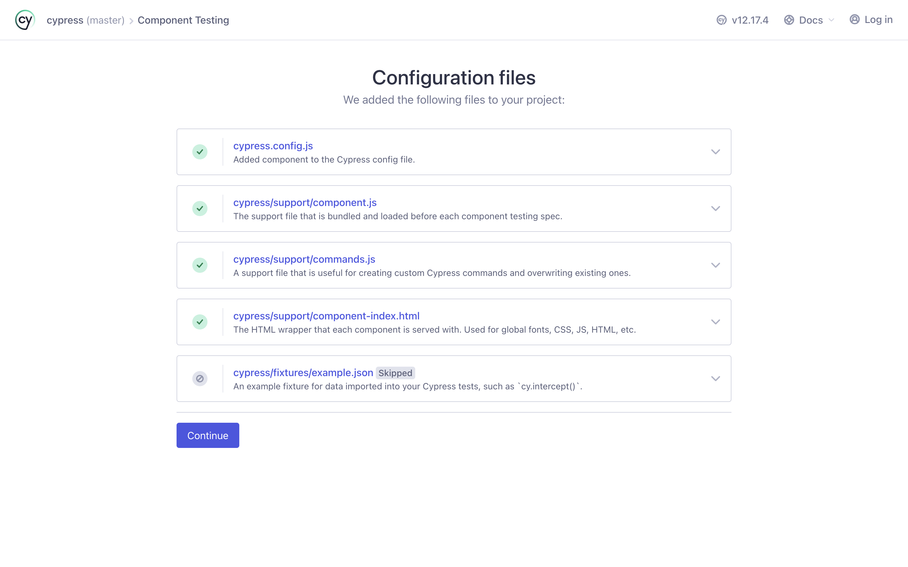

# React Testing with Cypress

## Getting Started
- Run `yarn` to install dependencies
- Run `yarn start` to start the app

## Initial Cypess Setup
- Read the documentation https://docs.cypress.io/guides/component-testing/react/overview
- Run `yarn add cypress -D` to install Cypress
- Open Cypress with `yarn cypress open`
- Welcome to Cypress! 
- If you click End-to-end Testing 
- This is what you will see 
- If you click Component Testing 
- You must install dependencies and configuration files in Cypress

- Then, choose the browser you want to use for testing

- This is what you will see 